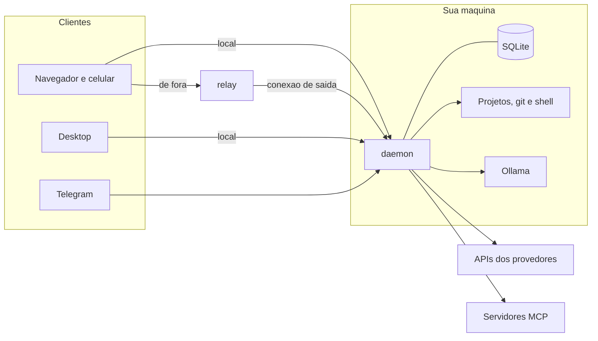

# Agent Hub

Um gerenciador de modelos de IA que roda na sua maquina. A cada mensagem ele
escolhe o modelo que resolve pelo menor custo, melhora o pedido antes de mandar
e decide por codigo o que nao deve ficar na mao do modelo: quais ferramentas
entram, o que precisa de aprovacao, quanto pode gastar e quando uma resposta
precisa ser conferida.

Funciona com Claude, DeepSeek, Gemini, OpenAI e modelos locais pelo Ollama, e
voce usa pelo navegador, pelo app de desktop (Windows e Linux), pelo celular ou
pelo Telegram, sempre olhando para as mesmas conversas.

> Codigo aberto para leitura e uso nao comercial, sob a
> [PolyForm Noncommercial 1.0.0](LICENSE). Uso comercial nao e permitido.

**Documentacao completa na [wiki](https://github.com/raylison100/agent-hub/wiki).**

## O que ele faz

| Area | Em uma linha |
|---|---|
| Roteamento por mensagem | regras, classificador e pontuacao de capacidade contra custo e contexto escolhem o agente de cada pedido |
| Custo sob controle | ledger por chamada, orcamento por run, sessao, agente e mes, desconto de horario do DeepSeek, relatorio e CSV |
| Varios provedores | Anthropic, DeepSeek, Gemini, OpenAI (Chat e Responses) e Ollama com adaptadores proprios sobre os SDKs oficiais |
| Ferramentas com politica | leitura, escrita e execucao com allow, ask ou deny; comando destrutivo sempre pergunta; sandbox por container |
| Conectores MCP | servidores stdio e HTTP, OAuth 2.1, risco por ferramenta, tela para conectar e desconectar |
| Contexto do projeto | instrucoes, glossario, memoria ativada por regra, specs, decisoes e base de conhecimento com citacao |
| Automacao | agendamentos por cron, gatilhos por webhook assinado, workflows com etapas fixas e portao de confianca |
| Subagentes | delegacao com ou sem espera, em worktree git isolada |
| Acesso de qualquer lugar | relay com cifra ponta a ponta, login por senha com credencial por dispositivo, push no celular |
| Integracao | servidor MCP para o Claude Code usar seus agentes, protocolo A2A, OpenTelemetry, Standard Webhooks |

## Como as partes se encaixam



O **daemon** e a fonte da verdade: guarda conversas e custos, chama os modelos,
roda as ferramentas e serve a interface. Os clientes sao so janelas para ele. As
chaves de API nunca saem da sua maquina.

## Repositorios

O projeto e dividido em repositorios independentes. Este aqui e o ponto de
partida: Makefile, scripts de desenvolvimento e a wiki.

| Repositorio | Papel |
|---|---|
| [agent-hub](https://github.com/raylison100/agent-hub) | ponto de partida, Makefile, scripts e wiki |
| [agent-hub-core](https://github.com/raylison100/agent-hub-core) | biblioteca TypeScript: adaptadores, laco do agente, custo, roteamento, ferramentas, protocolo |
| [agent-hub-daemon](https://github.com/raylison100/agent-hub-daemon) | servico local: sessoes, runs, aprovacoes, automacao, conectores, API WebSocket |
| [agent-hub-web](https://github.com/raylison100/agent-hub-web) | interface Vue 3 como PWA, a mesma no navegador, no celular e no desktop |
| [agent-hub-agents](https://github.com/raylison100/agent-hub-agents) | perfis, papeis, skills, workflows, precos, roteamento e politicas, em texto |
| [agent-hub-desktop](https://github.com/raylison100/agent-hub-desktop) | app Tauri 2 para Windows e Linux |
| [agent-hub-relay](https://github.com/raylison100/agent-hub-relay) | retransmissor sem estado para acesso remoto |
| [agent-hub-channels](https://github.com/raylison100/agent-hub-channels) | clientes em plataformas de mensagem, hoje Telegram |
| [agent-hub-docs](https://github.com/raylison100/agent-hub-docs) | planejamento, arquitetura, ADRs e a fonte das paginas da wiki |

## Comecar

Requisitos: Linux ou WSL, Node 24 com pnpm, git e, para modelo local, Docker.

```bash
git clone https://github.com/raylison100/agent-hub.git
cd agent-hub
bash clonar-tudo.sh
make build
make dev
```

Abra `http://127.0.0.1:47311`. Na propria maquina a conexao e automatica. Em
Configuracoes, Chaves, cadastre a chave de pelo menos um provedor e comece a
conversar. O passo a passo, com modelo local e servico do systemd, esta em
[Instalacao](https://github.com/raylison100/agent-hub/wiki/Instalacao).

`make` sem argumento lista todos os comandos.

## Estado

Uso pessoal diario, em evolucao. O que ja foi medido esta registrado nas
paginas da wiki, com os numeros. Os proximos passos estao em
[Roadmap](https://github.com/raylison100/agent-hub/wiki/Roadmap).

## Licenca

[PolyForm Noncommercial 1.0.0](LICENSE). Pode ler, estudar, modificar e usar
para fins pessoais, de pesquisa, ensino ou em organizacao sem fins lucrativos.
Uso comercial, inclusive dentro de empresa ou como servico pago, nao e
permitido sem autorizacao do autor.

Required Notice: Copyright (c) 2026 Raylison Nunes (https://github.com/raylison100)
